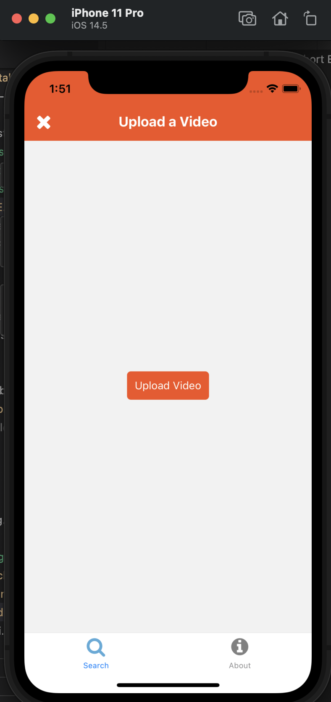

# CS52 React Short EC

Implemented React-Intro youtube search in React Native.

## What Worked Well
*Possibly* slowly catching on to React Native we shall see. 
Interesting to stick the styling into the components themselves instead of a generic
stylesheet. 

## What Didn't
Ideally would have liked to debounce the `search`/`fetchData`.

## Screenshots
Running locally

